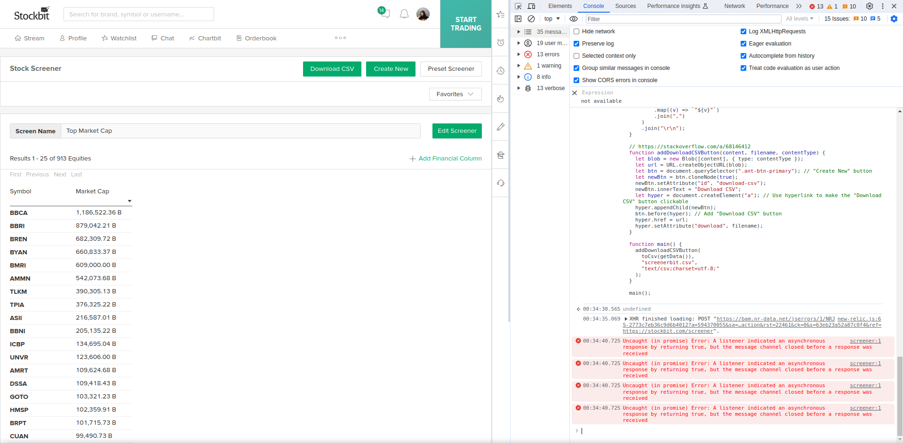

# screenerbit-to-csv

Convert Stockbit Screener Result to CSV

> > I can't find loan to deposit ratio.
> >
> > I can't find cost to income ratio.
> >
> > I can't find CAGR of expense.
> >
> > Even if I have all of the ratios, copy pasting the screener result to my spreadsheet is still tedious!
>
> Have you tried screenerbit-to-csv?
>
> You can download your screener result in csv and extend your analysis in Google Sheets.

## How to use

1. Go to Stockbit Screener ([stockbit.com/screener](stockbit.com/screener))
2. Setup your screener rules
3. Copy the script in `script.js` to your browser console (for Chrome, use `Option + ⌘ + J` (MacOS), or `Shift + CTRL + J` (Windows/Linux).)
4. Press `Enter`
5. A "Download CSV" button will appear in your screener
6. Click "Download CSV" button to download the csv of you screener result

PS. Ensure that you've logged in to Stockbit
